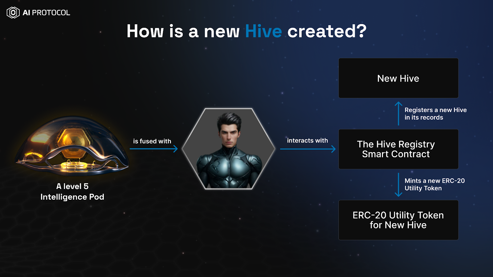
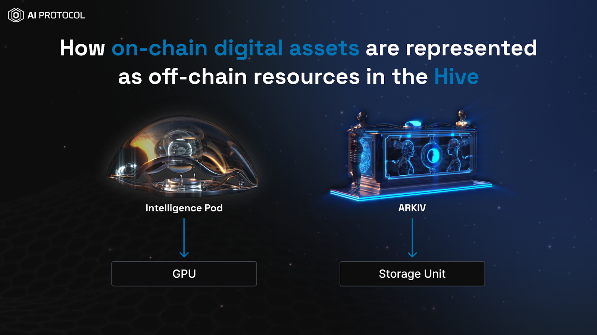

## Hives
A Hive is an on-chain abstraction, allowing
* DPTs to have decentralized access to AI models, storage, GPUs and other resources.
* Resource providers to utilize their resources more effectively and transparently.
* Hive owners build economies around the Hives, and attract participants of the various kind.

This is achieved by enabling trustless coordination between various on-chain and off-chain components of the
AI Protocol.

From the technical point of view,
the Hive is a record in the `HiveRegistry` smart contract; the Hive:
1) is bound to one (and only one) AI Pod,
2) has one (and only one) ERC20 token enabling the Hive economy,
3) has one and only one hiveURI pointing to some off-chain resource with the information about the Hive
   (possibly a website),
4) has any number of NFTs (assets) bound to it (pre-sorted by category), and each NFT
   * has one (and only one) category within the Hive.
   * cannot join other hives (can only join 1 Hive at a time)
   * NFT which created a Hive cannot join the same Hive, or any other Hive.

Every Hive has the following components:
 * Native ERC-20 Utility Token
 * Hive Smart Contracts
 * Distributed Inference Cluster of GPUs
 * Distributed Storage Cluster
 * Tokenized Digital Assets
 * DPTs

Check out our guides to perform various operations with Hives

## How To

* [Launch a Utility Token for your Hive?](./guides/how-to-launch-utility-token/how-to-launch-utility-token.md)
* [Do an Airdrop for your Hive?](./guides/how-to-airdrop.md)
* [Create a Liquidity Pool on Uniswap for the Utility Token of your Hive?](./guides/how-to-create-liquidity-pool.md)
* [Create/Update/Join a Hive](./guides/how-to-hive.md)